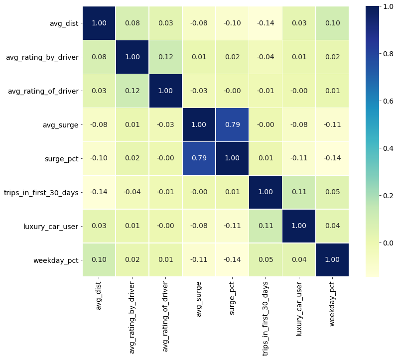
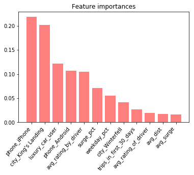
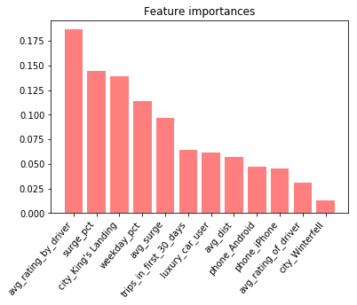
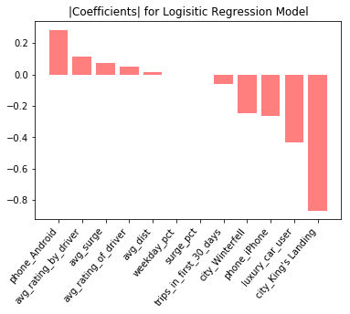
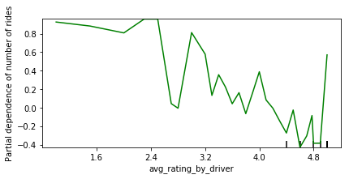
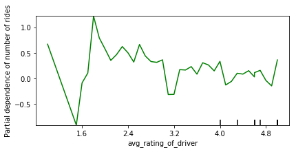
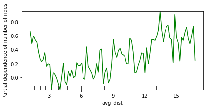
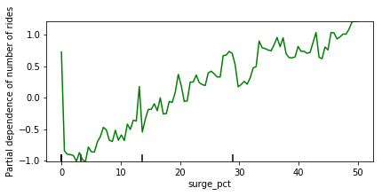

# Comparison of parametric and non-parametric models in predicting churn
### Carly Wolfbrandt

## Table of Contents
1. [Objective](#objective)
2. [Exploratory Data Analysis](#eda)
    1. [Dataset](#dataset)
    2. [Data Cleaning](#cleaning)
    3. [Feature Engineering](#engineering)
3. [Modelling](#model)
    1. [Non-Parametric](#non)
        1. [XGboost](#boost)
        2. [Random Forest](#rf)
    2. [Parametric](#par)
4. [Insights](#insight)

## Objective 

Use rideshare data set to help understand what factors are the best predictors for churn, and offer insights to help improve customer retention.

## Exploratory Data Analysis 

### Dataset 

A ride-sharing company (Company X) is interested in predicting rider retention. To help explore this question, we used a sample dataset of a cohort of users who signed up for an account in January 2014. The data was pulled on July 1, 2014; we consider a user retained if they were “active” (i.e. took a trip) in the preceding 30 days (from the day the data was pulled). In other words, a user is "active" if they have taken a trip since June 1, 2014.

Here is a detailed description of the data:

***CATEGORICAL***
- `city`: city this user signed up in
- `phone`: primary device for this user

***NUMERICAL***
- `signup_date`: date of account registration; in the form `YYYYMMDD`
- `last_trip_date`: the last time this user completed a trip; in the form `YYYYMMDD`
- `avg_dist`: the average distance (in miles) per trip taken in the first 30 days after signup
- `avg_rating_by_driver`: the rider’s average rating by their drivers over all of their trips
- `avg_rating_of_driver`: the rider’s average rating of their drivers over all of their trips
- `surge_pct`: the percent of trips taken with surge multiplier > 1
- `avg_surge`: The average surge multiplier over all of this user’s trips
- `trips_in_first_30_days`: the number of trips this user took in the first 30 days after signing up
- `weekday_pct`: the percent of the user’s trips occurring during a weekday
- `luxury_car_user`: TRUE if the user took a luxury car in their first 30 days; FALSE otherwise

**Table 1**: Initial dataset

|    |   avg_dist |   avg_rating_by_driver |   avg_rating_of_driver |   avg_surge | city           | last_trip_date      | phone   | signup_date         |   surge_pct |   trips_in_first_30_days | luxury_car_user   |   weekday_pct |
|---:|-----------:|-----------------------:|-----------------------:|------------:|:---------------|:--------------------|:--------|:--------------------|------------:|-------------------------:|:------------------|--------------:|
|  0 |       3.67 |                    5   |                    4.7 |        1.1  | King's Landing | 2014-06-17 00:00:00 | iPhone  | 2014-01-25 00:00:00 |        15.4 |                        4 | True              |          46.2 |
|  1 |       8.26 |                    5   |                    5   |        1    | Astapor        | 2014-05-05 00:00:00 | Android | 2014-01-29 00:00:00 |         0   |                        0 | False             |          50   |
|  2 |       0.77 |                    5   |                    4.3 |        1    | Astapor        | 2014-01-07 00:00:00 | iPhone  | 2014-01-06 00:00:00 |         0   |                        3 | False             |         100   |
|  3 |       2.36 |                    4.9 |                    4.6 |        1.14 | King's Landing | 2014-06-29 00:00:00 | iPhone  | 2014-01-10 00:00:00 |        20   |                        9 | True              |          80   |
|  5 |      10.56 |                    5   |                    3.5 |        1    | Winterfell     | 2014-06-06 00:00:00 | iPhone  | 2014-01-09 00:00:00 |         0   |                        2 | True              |         100   |

### Data Cleaning 

Table 2 shows the data types and number of null values for each column.

**Table 2**: Initial data type and null value descriptions

 |   column name |   information |
 |---:|-----------:|
|avg_dist  |                50000 non-null float64 |
|avg_rating_by_driver   |   49799 non-null float64|
|avg_rating_of_driver  |    41878 non-null float64|
|avg_surge    |             50000 non-null float64|
|city    |                  50000 non-null object|
|last_trip_date    |        50000 non-null object|
|phone       |              49604 non-null object|
|signup_date    |           50000 non-null object|
|surge_pct      |           50000 non-null float64|
|trips_in_first_30_days   | 50000 non-null int64|
|luxury_car_user |          50000 non-null bool|
|weekday_pct    |           50000 non-null float64|

There are 3 columns with null values, `avg_rating_by_driver`, `avg_rating_of_driver` and `phone`. These will need to be dealt with alongisde the incorrectly typed `signup_date` and `last_trip_date` columns.  Furthermore, the 2 categorical values, `city` and `phone` need to be converted to dummy variables.

Figure 1 shows the correlation matrix for the features.

**Figure 1**: Correlation matrix for the features in the dataset

The only features that seem strongly correlated are `surge_pct` and `avg_surge`, therefore no features needed to be dropped.

**Table 3**: Cleaned data type and null value descriptions

 |   column name |   information |
 |---:|-----------:|
|avg_dist                |  50000 non-null float64|
|avg_rating_by_driver    |  50000 non-null float64|
|avg_rating_of_driver     | 50000 non-null float64|
|avg_surge                 |50000 non-null float64|
|last_trip_date      |      50000 non-null datetime64[ns]|
|signup_date          |     50000 non-null datetime64[ns]|
|surge_pct             |    50000 non-null float64|
|trips_in_first_30_days |   50000 non-null int64|
|luxury_car_user    |       50000 non-null bool|
|weekday_pct         |      50000 non-null float64|
|city_King's Landing  |     50000 non-null uint8|
|city_Winterfell     |      50000 non-null uint8|
|phone_Android        |     50000 non-null uint8|
|phone_iPhone          |    50000 non-null uint8|

### Data Cleaning 

In looking at the data, the `signup_date` appears to be a key feature. The longer a user has been active, the more likely they are to continue being an active user. Also, users who use the luxury car service (`luxury_car_user` = True), have expendable income and are more likely to use a car service more often. The `avg_rating_of_driver` field is also important, as users who are consistently rating their drivers highly, are probably more likely to be happy with the product. Furthermore, our 2 categorical features are probably also correlated with whether or not a user churns. The `city` a user lives in, whether it is denser or more spread out, the service has good coverage or bad, etc. could be correlated to their happiness with the product. Also, the `phone` feature is probably useful, however this feature is dominated by iPhone users (by 3x) therefore, there could be some bias in this data.

### Feature Engineering 

There was still no target value for modeling, since there was no feature corresponding to whether or not a user had churned. The `churn` column was engineered from the values of the `last_trip_date` and the date that the data was pulled, July 1st. If there had been more than 30 days since a user had last ridden and the date the data was pulled, they were said to have churned.

**Table 3**: Final dataset for modeling

|    |   avg_dist |   avg_rating_by_driver |   avg_rating_of_driver |   avg_surge | last_trip_date      | signup_date         |   surge_pct |   trips_in_first_30_days | luxury_car_user   |   weekday_pct |   city_King's Landing |   city_Winterfell |   phone_Android |   phone_iPhone |   days_since_last_ride | churn   |   days_since_customer |
|---:|-----------:|-----------------------:|-----------------------:|------------:|:--------------------|:--------------------|------------:|-------------------------:|:------------------|--------------:|----------------------:|------------------:|----------------:|---------------:|-----------------------:|:--------|----------------------:|
|  0 |       3.67 |                    5   |                    4.7 |        1.1  | 2014-06-17 00:00:00 | 2014-01-25 00:00:00 |        15.4 |                        4 | True              |          46.2 |                     1 |                 0 |               0 |              1 |                     14 | False   |                   157 |
|  1 |       8.26 |                    5   |                    5   |        1    | 2014-05-05 00:00:00 | 2014-01-29 00:00:00 |         0   |                        0 | False             |          50   |                     0 |                 0 |               1 |              0 |                     57 | True    |                   153 |
|  2 |       0.77 |                    5   |                    4.3 |        1    | 2014-01-07 00:00:00 | 2014-01-06 00:00:00 |         0   |                        3 | False             |         100   |                     0 |                 0 |               0 |              1 |                    175 | True    |                   176 |
|  3 |       2.36 |                    4.9 |                    4.6 |        1.14 | 2014-06-29 00:00:00 | 2014-01-10 00:00:00 |        20   |                        9 | True              |          80   |                     1 |                 0 |               0 |              1 |                      2 | False   |                   172 |
|  4 |       3.13 |                    4.9 |                    4.4 |        1.19 | 2014-03-15 00:00:00 | 2014-01-27 00:00:00 |        11.8 |                       14 | False             |          82.4 |                     0 |                 1 |               1 |              0 |                    108 | True    |                   155 |

## Modelling 

One parametric (logistic regression) and two non-parametric (XGboost and Random Forest) models were trained and compared.

### Non-Parametric 

Algorithms that do not make strong assumptions about the form of the mapping function are called nonparametric machine learning algorithms. By not making assumptions, they are free to learn any functional form from the training data.

#### XGBoost 

**Figure 3**: Feature importances for the XGboost model

Test Accuracy for XGBoost model: 78.8%

Hyper Parameters:
 - max_depth=2
 - learning_rate=0.05
 - n_estimators=2000
 - subsample = .4

#### Random Forest 

**Figure 4**: Feature importances for the random forest model

Test Accuracy for Random Forest Model : 77.4%

Hyper Parameters:
 - n_estimators=200
 - max_depth=10

### Parametric 

Assumptions can greatly simplify the learning process, but can also limit what can be learned. Algorithms that simplify the function to a known form are called parametric machine learning algorithms.

#### Logistic Regression 

**Figure 5**: Normalized coefficients for the logistic regression model

Test Accuracy for Random Forest Model : 70.8%

## Insights 

`King's Landing`and `avg_rating_by_driver` both show up as high importance features in all 3 models. The feature importances from Figures 3 and 4 are lacking directionality, i.e. they don't show whether a feature is important in predicting if a user churned.

For interpretability, Figure 5 (the logistic model normalized coefficients) is interesting, as the coefficients show which features are driving the target to not churn (negative coefficients), and which features are leading to churn (positive coefficients).

Finally, partial dependency plots from the XGboost model show how changes in each feature affect the probability of churning. Figure 6 shows that, as a customer's average rating increases, then their likelihood of churning decreases. This is in line with intuition, as customers who are visibly unhappy, perhaps to the point of being reprimanded by their drivers and receiving a bad review, are more likely to churn.

**Figure 6**: Partial dependency plot showing relationship between churn likelihood (y) and the customer's average rating by drivers (x)

Figure 7 shows a similar trend to Figure 6, wherein as the customer's average rating of their drivers increases, their likelihood of churn decreases. Intuitively this makes sense, as customers who are having bad experiences with their drivers for whatever reason are less likely to continue using the service. However, it is worth noting that the slope of this line is far flatter than the slope of Figure 5. This could be related to the business model of car-sharing, where drivers who receive more than one negative review are removed from the application. Since drivers are penalized far more heavily than customers for getting bad reviews, the impotus is on drivers to give great service and get higher reviews. Therefore, there is probably less of a difference in customer service between drivers getting 4 stars vs. 5 stars.

**Figure 7**: Partial dependency plot showing relationship between churn likelihood (y) and the customer's average rating of drivers (x)

Figure 8 shows that users who only use the service to go short distances, as well as users who use it to travel very far have the highest probability of churning. The reasons for this could be a perception of value problem, wherein both very short rides and abnormally long rides could be perceived as too expensive. Users who are consistently traveling very far probably need alternative transportation methods, since the price adds up quickly. Similarly, users who are consistently traveling very short distances are probably more likely to find a cheaper method of transportation, like walking or riding a bike, to avoid the cost.

**Figure 8**: Partial dependency plot showing relationship between churn likelihood (y) and the distance traveled (x)

Figure 9 shows that as the percent of trips taken while paying surge premiums increases, the likelihood of churning increases. This is also a perception of value problem, where customers who pay extra for the service due to demand spikes, don't see the perceived value in the service and are more likely to discontinue use.

**Figure 9**: Partial dependency plot showing relationship between churn likelihood (y) and the percent of rides where the customer was paying surge pricing (x)

